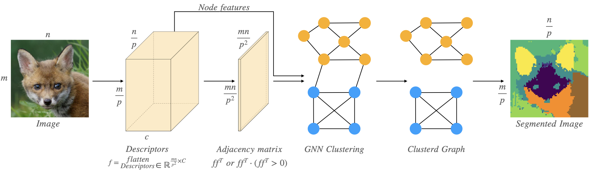
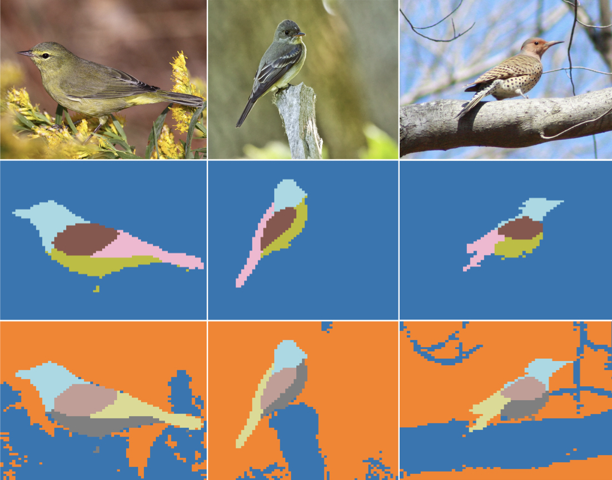

# DeepCut: Unsupervised Segmentation using Graph Neural Networks Clustering

<div align="center">

[](https://arxiv.org/abs/2212.05853)
[](https://sampl-weizmann.github.io/DeepCut/)
[](https://opensource.org/licenses/MIT)
</div>



This code accompanies the paper Deep-Cut: Unsupervised-GNN-Segmentation.

## Abstract
Image segmentation is a fundamental task in computer vision.
Data annotation for training supervised methods can be labor-intensive, motivating unsupervised methods.
Current approaches often rely on extracting deep features from pre-trained networks to construct a graph, and classical clustering methods like k-means and normalized-cuts are then applied as a post-processing step. However, this approach reduces the high-dimensional information encoded in the features to pair-wise scalar affinities.
To address this limitation, this study introduces a lightweight Graph Neural Network (GNN) to replace classical clustering methods while optimizing for the same clustering objective function. Unlike existing methods, our GNN takes both the pair-wise affinities between local image features and the raw features as input. This direct connection between the raw features and the clustering objective enables us to implicitly perform classification of the clusters between different graphs, resulting in part semantic segmentation without the need for additional post-processing steps.
We demonstrate how classical clustering objectives can be formulated as self-supervised loss functions for training an image segmentation GNN. Furthermore, we employ the Correlation-Clustering (CC) objective to perform clustering without defining the number of clusters, allowing for k-less clustering.
We apply the proposed method for object localization, segmentation, and semantic part segmentation tasks, surpassing state-of-the-art performance on multiple benchmarks.
## How to run?
### Google colab
[](https://colab.research.google.com/drive/1LTz2TuQChWCGC_q5wiTUPFPmG1Fl30SS?usp=sharing)

### Requirements:
This code requirements are stated at ```requirements.txt```

### Project structure:
```./images```: Example images.  
```Segment.py``` : Main function, includes all parameters of various modes.  
```example.ipynb```: Interactive notebook with a running example.  
```gnn_pool.py```: Normalized-cut GNN pooling operator implementation in pytorch.   
```gnn_pool_cc.py```: Correlation-Clustering GNN pooling operator implementation in pytorch.  
```extractor.py```: Deep features extraction from pretrained transformer.  
```mat_extract```: Deep features extraction and manipulation to create image graph.  
```vision_transformers.py```: Pytorch implementation of VIT.  
```util.py```: Project utilities.  
```bilateral_solver.py```: Implementation of *Barron, Jonathan T., and Ben Poole* [**"The fast bilateral solver"**](https://arxiv.org/abs/1511.03296) ECCV 2016.  


## Examples:



## License:
© 2023 The Weizmann Institute of Science

Permission is hereby granted, free of charge, to any person obtaining  
a copy of this software and associated documentation files (the  
"Software"), to deal in the Software without restriction, including  
without limitation the rights to use, copy, modify, merge, publish,  
distribute, sublicense, and/or sell copies of the Software, and to  
permit persons to whom the Software is furnished to do so, subject to  
the following conditions:  

The above copyright notice and this permission notice shall be  
included in all copies or substantial portions of the Software.  

THE SOFTWARE IS PROVIDED "AS IS", WITHOUT WARRANTY OF ANY KIND,  
EXPRESS OR IMPLIED, INCLUDING BUT NOT LIMITED TO THE WARRANTIES OF  
MERCHANTABILITY, FITNESS FOR A PARTICULAR PURPOSE AND  
NONINFRINGEMENT. IN NO EVENT SHALL THE AUTHORS OR COPYRIGHT HOLDERS BE  
LIABLE FOR ANY CLAIM, DAMAGES OR OTHER LIABILITY, WHETHER IN AN ACTION  
OF CONTRACT, TORT OR OTHERWISE, ARISING FROM, OUT OF OR IN CONNECTION  
WITH THE SOFTWARE OR THE USE OR OTHER DEALINGS IN THE SOFTWARE.